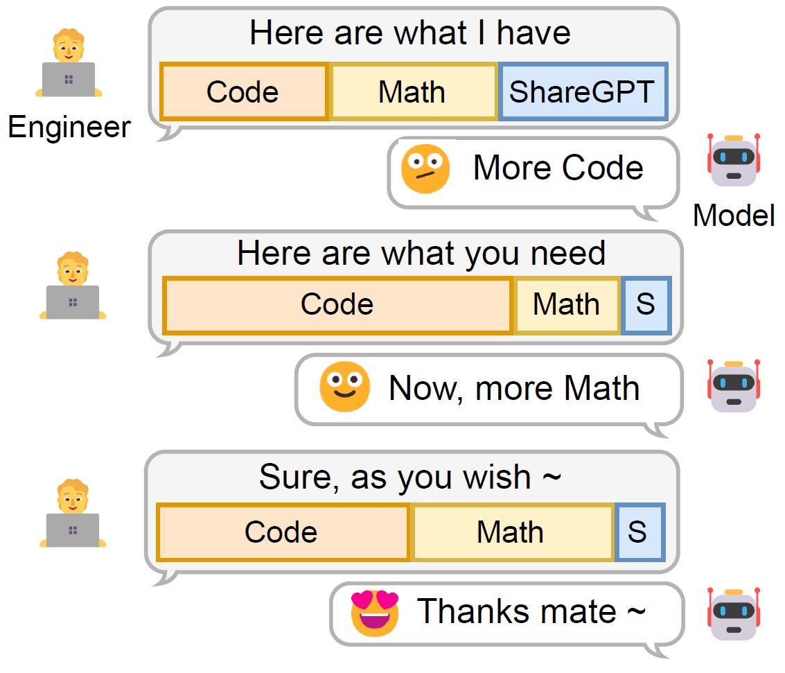
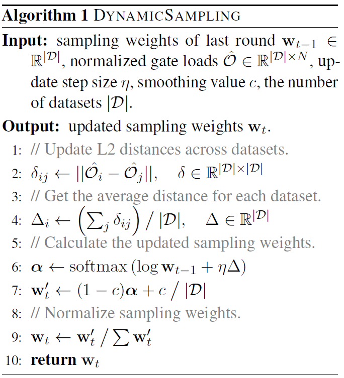

# 🍼 Dynamic Data Mixing Maximizes Instruction Tuning for Mixture-of-Experts

<div align="center">
    📃<a href="" target="_blank">Paper</a> | 💾<a href="https://huggingface.co/datasets/Spico/dynamic-moe-sft-instructions" target="_blank">Dataset</a> | 📦<a href="https://huggingface.co/Spico/LLaMA-MoE-v1-2_8-DynamicSFT" target="_blank">Model</a>
</div>


😎 This is the official implementation of the paper [Dynamic Data Mixing Maximizes Instruction Tuning for Mixture-of-Experts](https://arxiv.org/).

🔍 **TL;DR**: We devise a dynamic data sampling method for maximizing the instruction tuning efficacy of MoE models.

✨ **Novelty**: We use the token routing preference of MoE to build dataset-level representations and dynamically adjust the sampling weight of datasets. In other words, **we babysit MoE models by feeding their favorite data soup** 🍼.

Mixture-of-Experts (MoE) models have shown remarkable capability in instruction tuning, especially when the number of tasks scales.
However, previous methods simply merge all training tasks (e.g. creative writing, coding, and mathematics) and apply fixed sampling weights, without considering the importance of different tasks as the model training state changes.
In this way, the most helpful data cannot be effectively distinguished, leading to suboptimal model performance.
To reduce the potential redundancies of datasets, we make the first attempt and propose a novel dynamic data mixture for MoE instruction tuning.
Specifically, inspired by MoE's token routing preference, we build dataset-level representations and then capture the subtle differences among datasets.
Finally, we propose to dynamically adjust the sampling weight of datasets by their inter-redundancies, thus maximizing global performance under a limited training budget.
The experimental results on two MoE models demonstrate the effectiveness of our approach on both downstream knowledge \& reasoning tasks and open-ended queries.

<div align="center">

| Intuition | Algorithm |
| --------- | --------- |
|||

</div>

## 🌴 Setup

- Installation

```bash
# base env: cuda==11.8, python==3.11, torch==2.1.2+cu118, transformers==4.36.2
conda install git
conda install conda-forge::git-lfs
# install deps
pip install wandb
pip install "fschat[model_worker,webui,llm_judge]"
pip install python-dotenv
# install flash-attn
pip install flash-attn --no-build-isolation
# install vllm under cuda-11.8
pip install https://github.com/vllm-project/vllm/releases/download/v0.2.7/vllm-0.2.7+cu118-cp311-cp311-manylinux1_x86_64.whl
pip install --upgrade xformers --index-url https://download.pytorch.org/whl/cu118
# other deps for eval
pip install langdetect
pip install git+https://github.com/bigscience-workshop/promptsource.git
pip install immutabledict
```

- Training Preparation

```bash
# download training data
mkdir -p data/four
huggingface-cli download Spico/dynamic-moe-sft-instructions --repo-type dataset --local-dir data/four_types_mix --local-dir-use-symlinks False
# download models - you may want to change the save folder at your convenience
# llama-moe
huggingface-cli download llama-moe/LLaMA-MoE-v1-3_5B-2_8 --repo-type model --local-dir /mnt/petrelfs/zhutong/llama-moe-models/LLaMA-MoE-v1-3_5B-2_8-new --local-dir-use-symlinks False
# overwrite model files
cp src/models/llama_moe/*.py /mnt/petrelfs/zhutong/llama-moe-models/LLaMA-MoE-v1-3_5B-2_8-new
# moduleformer
huggingface-cli download ibm/MoLM-700M-4B --repo-type model --local-dir /mnt/petrelfs/zhutong/llama-moe-models/MoLM-700M-4B --local-dir-use-symlinks False
# overwrite model files
cp src/models/moduleformer/*.py /mnt/petrelfs/zhutong/llama-moe-models/MoLM-700M-4B
```

- Setup for Evaluation

```bash
# K&R evaluation except for MBPP
# commit: 89618bf8421d27c8cf28004d616b33fc5b305ceb
# 2024-01-16 16:45:29 commit: 032e879bf5ff39c08ae0db1f622a5b382a42eaa2
git clone https://github.com/EleutherAI/lm-evaluation-harness.git
cd lm-evaluation-harness
git checkout 032e879bf5ff39c08ae0db1f622a5b382a42eaa2
cp ../lm_eval.patch .
git apply lm_eval.patch
pip install -e .

# code evaluation
# commit: 9cfa52b
git clone https://github.com/bigcode-project/bigcode-evaluation-harness.git
cd bigcode-evaluation-harness
git checkout 9cfa52b
# change `pyext==0.5` in `bigcode-evaluation-harness/requirements.txt`, ref: https://github.com/bigcode-project/bigcode-evaluation-harness/pull/181
git checkout 9cfa52b
cp ../code_eval.patch .
git apply code_eval.patch
pip install -e .
```

## 🚀 QuickStart

- Training

The training files are located in `scripts/llama_moe` and `scripts/moduleformer`. We use a GPU cluster with Slurm resource scheduling. You can run the following command to start training.

```bash
sbatch scripts/llama_moe/llama_moe_dynamic.sh
```

Or, if your environment does not support Slurm, you can run the following command to start training.

```bash
task_name="llama_moe_dynamic"
model_type="auto"
model_name_or_path="/mnt/petrelfs/zhutong/llama-moe-models/LLaMA-MoE-v1-3_5B-2_8-new"
dataset_dir_or_path="data/four_types_mix/train"
eval_data_dir="data/four_types_mix/dev"

comment="llama-moe 2/8, four type mix, dynamic baseline, 4 gpus, eval_steps 100, max_eval_steps 5, w/ balance loss, w/ freeze gate, w/ gate noise"
base_dir="outputs"
output_dir="${base_dir}/${task_name}"
mkdir -p $output_dir
git diff > $output_dir/diff.patch
env > $output_dir/env
echo -e "Git commit: $(git log -1 --oneline)\n\nGit branch: $(git branch | grep "*")\n\nComment: ${comment}" > $output_dir/comment.txt

torchrun \
--nnodes 1 \
--nproc_per_node 4 \
--rdzv_id $RANDOM \
--rdzv_backend c10d \
--rdzv_endpoint $head_node:29522 \
    -m src.core.train \
        --do_train \
        --do_eval \
        --freeze_gate True \
        --eval_data_dir $eval_data_dir \
        --evaluation_strategy steps \
        --eval_steps 100 \
        --max_eval_steps 5 \
        --dynamic_sampling_criterion mean \
        --run_name $task_name \
        --model_type $model_type \
        --model_name_or_path $model_name_or_path \
        --dataset_dir_or_path $dataset_dir_or_path \
        --output_dir $output_dir \
        --deepspeed conf/ds_bf16_zero1.json \
        --bf16 True \
        --tf32 True \
        --torch_dtype bfloat16 \
        --per_device_train_batch_size 4 \
        --per_device_eval_batch_size 4 \
        --gradient_accumulation_steps 8 \
        --max_steps 2000 \
        --save_strategy steps \
        --save_steps 9999999999999 \
        --save_total_limit 1 \
        --learning_rate 2e-5 \
        --weight_decay 0. \
        --warmup_ratio 0.03 \
        --lr_scheduler_type cosine \
        --logging_steps 1 \
        --model_max_length 2048 \
        --gradient_checkpointing True \
        --report_to wandb
```

- Evaluation

After training, you can evaluate the model using the following command.

Please change the model path in `scripts/eval/multi.sh`, and run `bash scripts/eval/multi.sh`:

```bash
# e.g.
single_eval reasoning moduleformer_random outputs/moduleformer_random/2533914/
multi_eval moduleformer_random outputs/moduleformer_random/2533914/
```

After all the jobs are finished, you can check the results via:

```bash
python -m src.eval.show results/moduleformer_random
```

If you want to evaluate on MT-Bench, the generated MT-Bench responses are located at `data/mt_bench/model_answer`. You can use these files with [fastchat/llm_judge](https://github.com/lm-sys/FastChat/blob/main/fastchat/llm_judge/README.md) to obtain the final results.

## 📋 Citation

```bibtex
@article{zhu-et-al-2024-dynamic-sft-for-moe,
  title={Dynamic Data Mixing Maximizes Instruction Tuning for Mixture-of-Experts},
  author={Zhu, Tong and Dong, Daize and Qu, Xiaoye and Ruan, Jiacheng and Chen, Wenliang and Cheng, Yu},
  journal={arXiv preprint},
  year={2024}
}
```

<hr>

<div align="center">
<p>💌 This project is licensed under Apache-2.0. We hope you enjoy it ~</p>
<a href="https://spico197.github.io/accept" target="_blank">❤️接好运❤️</a>
</div>
